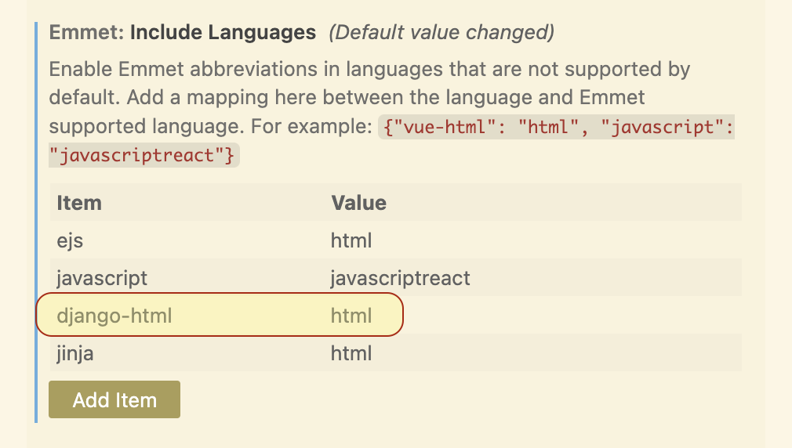

# Tips and Tricks for "Easier" Django Development

## Summary

This readme is designed to make your Django development (assuming with VSCode) a bit simpler and faster. It contains useful **setup instructions**, **extensions**, and **settings** to help optimize your workflow. Feel free to use the table of contents below to jump around. 🤠

Please let me know (open an issue, post on piazza, or email me at wderocco@bu.edu) if you have any **questions** or **suggestions** for things to add!

## Table of Contents

- [Tips and Tricks for "Easier" Django Development](#tips-and-tricks-for-easier-django-development)
  - [Summary](#summary)
  - [Table of Contents](#table-of-contents)
  - [1. Select Python Interpreter](#1-select-python-interpreter)
    - [What's wrong with default interpreter:](#whats-wrong-with-default-interpreter)
    - [Solution](#solution)
    - [Video walkthrough](#video-walkthrough)
  - [2. Configure VSCode `Emmet: Include Languages`](#2-configure-vscode-emmet-include-languages)
    - [What's wrong not including `Django-HTML`:](#whats-wrong-not-including-django-html)
    - [Solution](#solution-1)
      - [Demo](#demo)

## 1. Select Python Interpreter

By default, VSCode my not assign the correct [Python interpreter](https://code.visualstudio.com/docs/python/environments) when opening your Django folder.

### What's wrong with default interpreter:
- you must run `pipenv shell` every time you re-open the project in order to use Django-related commands
- **Intellisense** will not work and your code will likely be covered in **warnings** since the interpreter cannot recognize Django imports...

### Solution

1. get pipenv environment path

    ``` bash
    # cd into your `django` directory 
    cd django

    # exctract and COPY the path of the virtual environment
    pipenv --venv
    ```


2. update python interpreter in vscode

   - on mac: press `cmd+shift+p` (on windows: press `ctrl+shift+p`)
   - type "Python: Select Intepreter"
   - choose "Enter interpreter path..."
   - paste the path from pipenv --venv

You should only have to complete these steps once for you given django project!

### Video walkthrough
[](https://youtube.com/shorts/7TAE_Smo_hc)

## 2. Configure VSCode `Emmet: Include Languages`

This setup is used to configure abbreviations in languages that are not supported by default in VSCode. For you all, the most relevant one is `Django-HTML` (which is the file type that VSCode automtically recognizes for HTML files loated in your Django projects).

### What's wrong not including `Django-HTML`:
- By default, Emmet does not work in Django-HTML files. This means you won’t be able to use Emmet’s shorthand for expanding HTML elements, which can significantly slow down your workflow, especially when working with templates that contain a lot of HTML.


### Solution

1. Open your VSCode settings (Ctrl + , or Cmd + , on macOS).
1. Search for `Emmet: Include Languages` in the settings search bar.
3. Click on "Add item"
4. Add the following configuration to associate Django-HTML with HTML:

#### Demo
